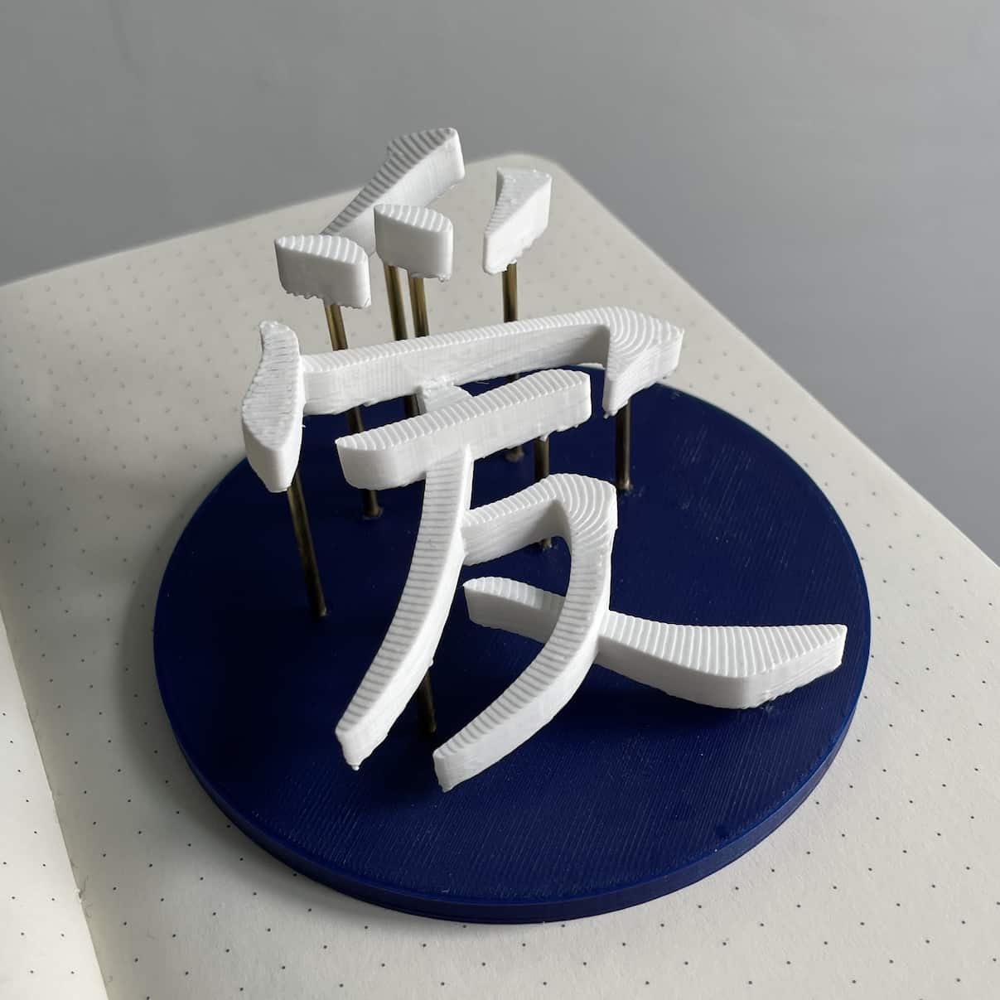

# 3d Hanzi Generator

## Introduction

This program generates a 3d model of a Hanzi/Kanji character using stroke data from [Make me a Hanzi](https://github.com/skishore/makemeahanzi). It extrudes the character with the stroke order as the Z dimension.

It does this by splitting up each stroke into parts following the stroke order, and then skewing each part to form a slope.

In this [blog post](https://dev.to/hansottowirtz/generating-sloping-3d-models-from-chinese-characters-opb) I go into detail about about the inner workings of this program. It uses SolidPython, OpenSCAD, Voronoi diagrams, PCA, and quite a lot of linear algebra.

## Examples

Watch [this YouTube video](https://www.youtube.com/watch?v=tn4bemVyHxs) to see some examples.



## Usage

The input of the program is a .yml file containing the settings to generate the model.

```bash
python src/main.py --out-scad main.scad --stl true --out-stl main.stl --settings examples/ai.yml --parts strokes
```

See [src/base_settings.yml](./src/base_settings.yml) for all configuration options.

## Installation

```bash
# Create a venv or similar, then:
pip3 install -r requirements.txt
```

### Installation on ARM macOS

Due to the unavailability of ARM-compatible wheels for Scipy (and other libraries), you can use Miniforge instead:
Note: this doesn't always work properly, so your mileage may vary.

```bash
cat requirements.txt | xargs -n 1 pip install # this will fail for some packages
conda create -n 3d-hanzi-venv
conda activate 3d-hanzi-venv
while read requirement; do conda install --yes $requirement || pip install $requirement; done < requirements.txt
```

Scipy issue: https://github.com/scipy/scipy/issues/13409

## Printing workflow

1. Generate strokes STLs and plate,pillars STLs
2. Verify design
3. Import to PrusaSlicer
4. Split to objects (top menu)
5. Export from PrusaSlicer as STL
6. Import in Cura
7. Use tree supports and raft to slice and print (preset available at [res/cura-preset.curaprofile](./res/cura-preset.curaprofile))

## Contributing

Please use `black` (`pip install black`) for formatting.
